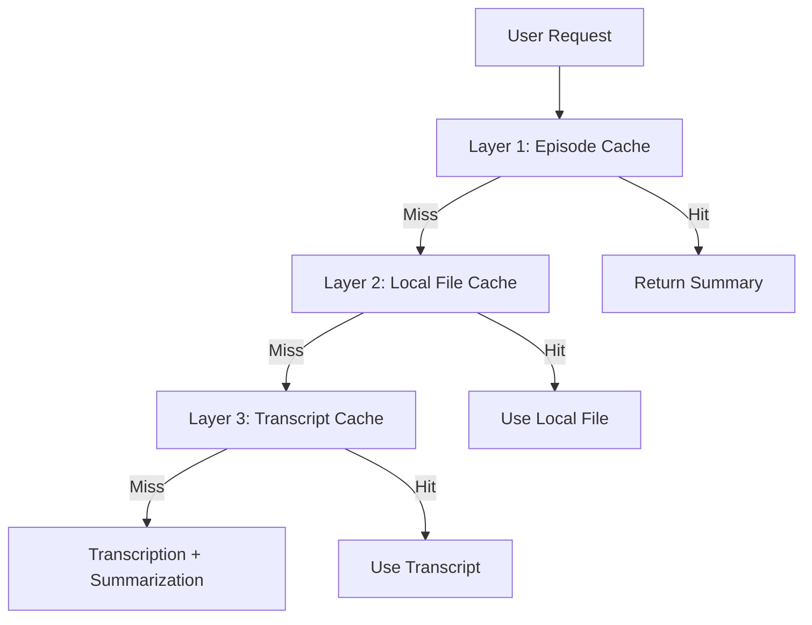

[](https://github.com/apatni24/EchoBrief/actions/workflows/ci.yml)

# 🎧 EchoBrief — Scalable Podcast Summarization Backend

**EchoBrief** is an event-driven backend system that transcribes and summarizes podcast episodes in real time. Users simply paste a podcast episode URL, choose a summary format (bullet points, narrative, or takeaways), and receive a high-quality summary within a minute for episodes up to 30 minutes.

> 🔗 **Live App**: [https://echobrief.onrender.com](https://echobrief.onrender.com)  
> ⏱️ **Summarizes a 30-minute podcast in <90 seconds**  
> 🌍 Deployed on low-latency infrastructure (Singapore – Render + Upstash)

---

## 🧠 Why This Project Stands Out

EchoBrief was built to solve real-world backend engineering challenges. It showcases:

- 🔄 Loose coupling across services using Redis Streams
- 📡 Real-time updates with WebSockets for instant feedback
- 🧠 Scalable summarization via LLaMA 3.3 70B LLMs
- 🐳 Unified Dockerized deployment with internal NGINX routing
- 🚦 Thoughtful design to handle cold starts and API rate limits
- 💾 **Three-layer caching system for optimal performance**
- 🧪 Comprehensive test coverage for reliability

---

### 🐳 Why Only One Dockerfile in a Microservices Setup?

Although EchoBrief follows a microservices architecture, all services are hosted on a single server and exposed on different ports. An NGINX reverse proxy is used to route traffic appropriately.

This design choice avoids multiple Dockerfiles and leverages Render's free-tier constraints efficiently.

---

## 🧩 Architecture


### 🔄 Event Flow

1. **Podcast Audio Resolver Service** (Port 8080)
   - Receives podcast URLs from frontend
   - Extracts audio files from Apple Podcasts/Spotify
   - Emits `audio_uploaded` events to Redis Streams

2. **Transcription Service** (Port 8081)
   - Consumes `audio_uploaded` events
   - Transcribes audio using AssemblyAI with speaker diarization
   - Emits `transcription_complete` events

3. **Summarization Service** (Port 8082)
   - Consumes `transcription_complete` events
   - Generates summaries using LLaMA 3.3 70B
   - Sends real-time updates via WebSockets

---

## 🚀 Recent Updates (2024)

- **Three-Layer Caching**: Now includes episode cache, local file cache, and transcript cache for maximum performance and cost savings.
- **Google Login & Usage Limits**: Anonymous users are limited to 10 podcasts or 150 minutes; Google login unlocks unlimited access (see frontend).
- **Mobile-Responsive Frontend**: All UI components are now fully responsive and optimized for mobile devices.
- **File Hash Optimization**: File hashes are computed during download, never requiring a second read.
- **Admin Cache Controls**: Invalidate, clear, and view cache stats via API endpoints.

---

## 💾 Three-Layer Caching System (2024)

EchoBrief now implements a robust three-layer caching system:

### 1. Episode Cache (Layer 1)
- **Key**: `episode:{platform}:{episode_id}:{summary_type}`
- **Value**: Full summary for a specific episode and summary type
- **TTL**: 7 days
- **Benefit**: Instant response for repeat requests

### 2. Local File Cache (Layer 2)
- **Storage**: `audio_files/download_cache.json`
- **Key**: Audio URL
- **Value**: `{ file_path, file_hash, episode_title }`
- **Benefit**: Avoids re-downloading audio files, enables cross-platform cache hits

### 3. Transcript Cache (Layer 3)
- **Key**: `transcript:file:{file_hash}`
- **Value**: Transcript text for a given audio file hash
- **TTL**: 7 days
- **Benefit**: Avoids re-transcribing identical audio, even across platforms

### 🔄 Caching Flow



- **Cache hits** at any layer result in instant or near-instant responses.
- **Cache miss** at all layers triggers full download, transcription, and summarization.

### 🏆 Performance
- **Cache hit**: 0–1s response
- **Cache miss**: 50–110s (full processing)
- **File hash**: Always computed during download (never reads file twice)
- **Cross-platform**: Identical content is cached regardless of source

---

## 🛡️ Usage Limits & Authentication
- **Anonymous users**: Limited to 10 podcasts or 150 minutes total
- **Google login**: Unlocks unlimited summaries and duration
- **Usage tracking**: Enforced in frontend, but backend is stateless for user data

---

## 🔁 Cold Start Optimization

Render auto-suspends inactive services, which can cause a ~25–30s delay on the first request. To combat this:

> ⚡ As soon as the frontend loads, it pings the backend's `/health` endpoint to **pre-warm** the server — ensuring fast, seamless user experience even after idle periods.

---

## 📨 Example Payload

Here's a sample event payload passed to the Redis Stream (`audio_uploaded`) when a podcast is fetched:

```json
{
  "file_path": "",
  "metadata": {
    "summary": "",
    "show_title": "",
    "show_summary": ""
  },
  "summary_type": "",
  "job_id": ""
}
```
**Fields explained:**

- `file_path`: Local/remote audio path  
- `metadata`: Podcast title, episode summary, and show description  
- `summary_type`: Format (e.g., `ts` = story-style/takeaways)  
- `job_id`: Correlation ID for async WebSocket updates  

---

## 🛠️ Tech Stack

| Layer              | Tool / Service                           |
|--------------------|------------------------------------------|
| Audio Resolution   | Python + feedparser                      |
| Transcription      | AssemblyAI (diarization + speech-to-text)|
| Summarization      | LLaMA 3.3 70B Versatile (via API)        |
| Events             | Redis Streams (Upstash – Singapore)      |
| Real-Time Updates  | WebSockets                               |
| Caching            | Redis (Upstash) with multi-layer strategy|
| Infrastructure     | Docker + NGINX + Render                  |
| Frontend           | React with dark mode support             |
| Testing            | pytest + Jest + comprehensive coverage   |

---

## 📁 Project Structure

```plaintext
echobrief-backend/
├── podcast_audio_resolver_service/    # RSS parsing, file download & event emit
│   ├── main.py                        # FastAPI app with cache endpoints
│   ├── get_audio.py                   # Audio extraction from platforms
│   ├── apple_scraper.py               # Apple Podcasts integration
│   ├── spotify_scraper.py             # Spotify integration
│   └── audio_upload_producer.py       # Redis Stream producer
├── transcription_service/             # Diarization + transcription via AssemblyAI
│   ├── main.py                        # FastAPI app
│   ├── assemblyai_transcriber.py      # Transcription logic
│   ├── audio_upload_consumer.py       # Redis Stream consumer
│   └── transcription_complete_producer.py # Event producer
├── summarization_service/             # LLM-based summarization
│   ├── main.py                        # FastAPI app with WebSocket support
│   ├── summarize.py                   # LLaMA integration with rate limiting
│   ├── transcription_complete_consumer.py # Redis Stream consumer
│   ├── ws_manager.py                  # WebSocket connection management
│   └── summary_types/                 # Different summary formats
│       ├── bullet_points_summary.py
│       ├── narrative_summary.py
│       └── takeaway_summary.py
├── cache_service.py                   # Three-layer caching implementation
├── redis_stream_client.py             # Redis Streams abstraction
├── nginx.conf                         # Reverse proxy config (internal routing)
├── Dockerfile                         # Container for all services
├── start.sh                           # Entrypoint to run everything
├── tests/                             # Comprehensive test suite
│   ├── test_cache_service.py          # Cache service unit tests
│   ├── test_cache_endpoints.py        # API endpoint tests
│   ├── test_cache_integration.py      # Integration tests
│   └── test_*.py                      # Other service tests
├── run_cache_tests.py                 # Cache test runner
├── test_three_layer_cache.py          # Three-layer caching demonstration
├── CACHE_TESTS_README.md              # Cache testing documentation
└── audio_files/                       # Local audio storage with download cache
```

---

## 📄 Summary Types Supported

EchoBrief supports the following summary formats:

- **Bullet Points** (`bs`): Structured breakdown of key points
- **Narrative** (`ns`): Story-style narrative summaries
- **Takeaways** (`