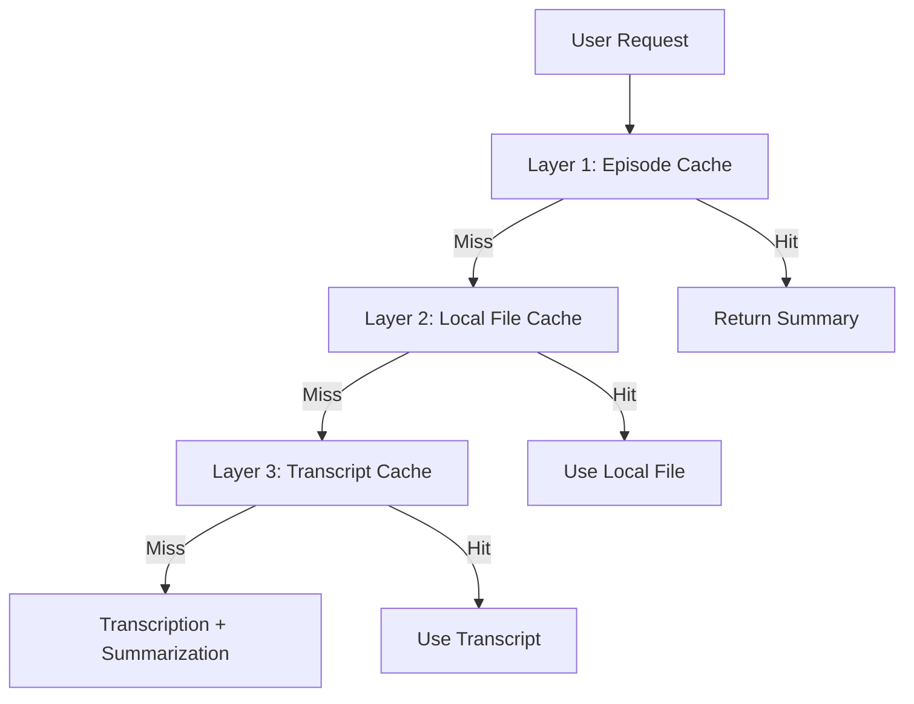

[](https://github.com/apatni24/EchoBrief/actions/workflows/ci.yml)

# 🎧 EchoBrief — Scalable Podcast Summarization Backend

**EchoBrief** is an event-driven backend system that transcribes and summarizes podcast episodes in real time. Users simply paste a podcast episode URL, choose a summary format (bullet points, narrative, or takeaways), and receive a high-quality summary within a minute for episodes up to 30 minutes.

> 🔗 **Live App**: [https://echobrief.onrender.com](https://echobrief.onrender.com)  
> ⏱️ **Summarizes a 30-minute podcast in <90 seconds**  
> 🌍 Deployed on low-latency infrastructure (Singapore – Render + Upstash)

## 📚 Table of Contents
- [Why This Project Stands Out](#-why-this-project-stands-out)
- [Architecture](#-architecture)
- [Recent Updates](#-recent-updates-2024)
- [Three-Layer Caching System](#-three-layer-caching-system-2024)
- [RSS Feed Caching](#-rss-feed-caching)
- [Real-Time Stage Acknowledgement](#-real-time-stage-acknowledgement)
- [LangChain Summarization Flow](#-langchain-summarization-flow)
- [Usage Limits & Authentication](#-usage-limits--authentication)
- [Cold Start Optimization](#-cold-start-optimization)
- [Example Payload](#-example-payload)
- [Tech Stack](#-tech-stack)
- [Project Structure](#-project-structure)
- [Summary Types Supported](#-summary-types-supported)
- [API Rate Limiting](#-api-rate-limiting)
- [Testing](#-testing)
- [Getting Started (Local Dev)](#-getting-started-local-dev)
- [Cache Configuration](#-cache-configuration)
- [Frontend Screenshots](#-frontend-screenshots)
- [Author](#-author)
- [Future Enhancements](#-future-enhancements)
- [Contributing](#-contributing)
- [License](#-license)

---

## 🧠 Why This Project Stands Out

EchoBrief was built to solve real-world backend engineering challenges. It showcases:

- 🔄 Loose coupling across services using Redis Streams
- 📡 Real-time updates with WebSockets for instant feedback
- 🧠 Scalable summarization via OpenRouter (deepseek/deepseek-r1-distill-llama-70b:free)
- 🐳 Unified Dockerized deployment with internal NGINX routing
- 🚦 Thoughtful design to handle cold starts and API rate limits
- 💾 **Three-layer caching system for optimal performance**
- 🧪 Comprehensive test coverage for reliability

---

### 🐳 Why Only One Dockerfile in a Microservices Setup?

Although EchoBrief follows a microservices architecture, all services are hosted on a single server and exposed on different ports. An NGINX reverse proxy is used to route traffic appropriately.

This design choice avoids multiple Dockerfiles and leverages Render's free-tier constraints efficiently.

---

## 🧩 Architecture


### 🔄 Event Flow

1. **Podcast Audio Resolver Service** (Port 8080)
   - Receives podcast URLs from frontend
   - Extracts audio files from Apple Podcasts/Spotify
   - Emits `audio_uploaded` events to Redis Streams

2. **Transcription Service** (Port 8081)
   - Consumes `audio_uploaded` events
   - Transcribes audio using AssemblyAI with speaker diarization
   - Emits `transcription_complete` events

3. **Summarization Service** (Port 8082)
   - Consumes `transcription_complete` events
   - Generates summaries using OpenRouter (deepseek/deepseek-r1-distill-llama-70b:free)
   - Sends real-time updates via WebSockets

## 🦜🔗 LangChain Summarization Flow

EchoBrief uses [LangChain](https://python.langchain.com/) to orchestrate the LLM-based summarization process. Here's how it works:

1. **Prompt Construction:**
   - For each summary request, a prompt template is selected based on the summary type (bullet points, narrative, or takeaways).
   - The prompt includes the transcript, episode/show metadata, and (if available) the episode title and duration.

2. **LLM Chain Setup:**
   - The service uses LangChain's `ChatOpenAI` wrapper, configured to use OpenRouter as an OpenAI-compatible backend.
   - The model is always set to `deepseek/deepseek-r1-distill-llama-70b:free`.
   - API key rotation is supported for load distribution (using `OPENROUTER_API_KEY` and `OPENROUTER_API_KEY2`).

3. **Rate Limiting:**
   - To comply with OpenRouter's rate limits, the service enforces a 60-second cooldown between LLM calls.

4. **Summary Generation:**
   - The constructed prompt is sent to the LLM via LangChain's chain interface.
   - The output is parsed and returned to the user, and also cached for future requests.

5. **Summary Types:**
   - The summarization service supports three types: bullet points, narrative, and takeaways, each with its own prompt logic and output format.

**This modular approach makes it easy to add new summary types, swap LLM providers, or adjust prompt logic as needed.**

---

## 🚀 Recent Updates (2024)

- **Three-Layer Caching**: Now includes episode cache, local file cache, and transcript cache for maximum performance and cost savings.
- **Google Login & Usage Limits**: Anonymous users are limited to 10 podcasts or 150 minutes; Google login unlocks unlimited access (see frontend).
- **Summarization LLM Migration**: Switched from ChatGroq/LLaMA to OpenRouter (deepseek/deepseek-r1-distill-llama-70b:free) for all LLM summarization tasks. See ENV setup below.
- **Mobile-Responsive Frontend**: All UI components are now fully responsive and optimized for mobile devices.
- **File Hash Optimization**: File hashes are computed during download, never requiring a second read.
- **Admin Cache Controls**: Invalidate, clear, and view cache stats via API endpoints.

---

## 💾 Three-Layer Caching System (2024)

EchoBrief now implements a robust three-layer caching system:

### 1. Episode Cache (Layer 1)
- **Key**: `episode:{platform}:{episode_id}:{summary_type}`
- **Value**: Full summary for a specific episode and summary type
- **TTL**: 7 days
- **Benefit**: Instant response for repeat requests

### 2. Local File Cache (Layer 2)
- **Storage**: `audio_files/download_cache.json`
- **Key**: Audio URL
- **Value**: `{ file_path, file_hash, episode_title }`
- **Benefit**: Avoids re-downloading audio files, enables cross-platform cache hits

### 3. Transcript Cache (Layer 3)
- **Key**: `transcript:file:{file_hash}`
- **Value**: Transcript text for a given audio file hash
- **TTL**: 7 days
- **Benefit**: Avoids re-transcribing identical audio, even across platforms

### 🔄 Caching Flow



- **Cache hits** at any layer result in instant or near-instant responses.
- **Cache miss** at all layers triggers full download, transcription, and summarization.

### 🏆 Performance
- **Cache hit**: 0–1s response
- **Cache miss**: 50–110s (full processing)
- **File hash**: Always computed during download (never reads file twice)
- **Cross-platform**: Identical content is cached regardless of source

---

## 🗂️ RSS Feed Caching

To speed up repeated podcast lookups, EchoBrief now implements a file-based RSS feed cache:
- **Location:** `echobrief-backend/rss_cache/`
- **Key:** MD5 hash of the RSS feed URL
- **Value:** Raw XML of the RSS feed
- **TTL:** 1 hour (feeds are refreshed after expiry)
- **Benefit:** Dramatically reduces latency for popular podcasts and avoids repeated network requests for the same feed.

This cache is used automatically by the audio resolver service. No manual intervention is required.

---

## ⚡ Real-Time Stage Acknowledgement

EchoBrief now provides instant feedback to users about backend progress:
- As soon as the backend receives a `transcription_complete` event, it sends a WebSocket message to the frontend with status `summarization_received`.
- The frontend immediately updates the stage indicator to "Summarizing..." so users know their request is being processed by the LLM.
- When the summary is ready, a second WebSocket message delivers the result and moves the stage to "Complete".

**This ensures a more responsive and transparent user experience, especially for longer episodes.**

---

## 🕒 Troubleshooting & Timing

- **Where can delays occur?**
  - **RSS Feed Download:** Large or slow feeds can take several seconds. Now mitigated by RSS feed caching.
  - **Audio Download:** Only happens on cache miss; otherwise instant.
  - **Transcription:** AssemblyAI is fast, but large files may take up to a minute.
  - **Summarization:** LLM call via OpenRouter; typically 10–30 seconds.
  - **Cache Hits:** All layers (episode, file, transcript, RSS) are designed for sub-second response times.

- **How to diagnose?**
  - Check logs for cache hit/miss statistics.
  - Use the `/cache/stats` endpoint for real-time cache metrics.
  - Enable debug logging for detailed timing breakdowns.

---

## 🛡️ Usage Limits & Authentication
- **Anonymous users**: Limited to 10 podcasts or 150 minutes total
- **Google login**: Unlocks unlimited summaries and duration
- **Usage tracking**: Enforced in frontend, but backend is stateless for user data

---

## 🔁 Cold Start Optimization

Render auto-suspends inactive services, which can cause a ~25–30s delay on the first request. To combat this:

> ⚡ As soon as the frontend loads, it pings the backend's `/health` endpoint to **pre-warm** the server — ensuring fast, seamless user experience even after idle periods.

---

## 📨 Example Payload

Here's a sample event payload passed to the Redis Stream (`audio_uploaded`) when a podcast is fetched:

```json
{
  "file_path": "",
  "metadata": {
    "summary": "",
    "show_title": "",
    "show_summary": ""
  },
  "summary_type": "",
  "job_id": ""
}
```
**Fields explained:**

- `file_path`: Local/remote audio path  
- `metadata`: Podcast title, episode summary, and show description  
- `summary_type`: Format (e.g., `ts` = story-style/takeaways)  
- `job_id`: Correlation ID for async WebSocket updates  

---

## 🛠️ Tech Stack

| Layer              | Tool / Service                           |
|--------------------|------------------------------------------|
| Audio Resolution   | Python + feedparser                      |
| Transcription      | AssemblyAI (diarization + speech-to-text)|
| Summarization      | OpenRouter (deepseek/deepseek-r1-distill-llama-70b:free) |
| Events             | Redis Streams (Upstash – Singapore)      |
| Real-Time Updates  | WebSockets                               |
| Caching            | Redis (Upstash) with multi-layer strategy|
| Infrastructure     | Docker + NGINX + Render                  |
| Frontend           | React with dark mode support             |
| Testing            | pytest + Jest + comprehensive coverage   |

---

## 📁 Project Structure

```plaintext
echobrief-backend/
├── podcast_audio_resolver_service/    # RSS parsing, file download & event emit
│   ├── main.py                        # FastAPI app with cache endpoints
│   ├── get_audio.py                   # Audio extraction from platforms
│   ├── apple_scraper.py               # Apple Podcasts integration
│   ├── spotify_scraper.py             # Spotify integration
│   └── audio_upload_producer.py       # Redis Stream producer
├── transcription_service/             # Diarization + transcription via AssemblyAI
│   ├── main.py                        # FastAPI app
│   ├── assemblyai_transcriber.py      # Transcription logic
│   ├── audio_upload_consumer.py       # Redis Stream consumer
│   └── transcription_complete_producer.py # Event producer
├── summarization_service/             # LLM-based summarization
│   ├── main.py                        # FastAPI app with WebSocket support
│   ├── summarize.py                   # LLaMA integration with rate limiting
│   ├── transcription_complete_consumer.py # Redis Stream consumer
│   ├── ws_manager.py                  # WebSocket connection management
│   └── summary_types/                 # Different summary formats
│       ├── bullet_points_summary.py
│       ├── narrative_summary.py
│       └── takeaway_summary.py
├── cache_service.py                   # Three-layer caching implementation
├── redis_stream_client.py             # Redis Streams abstraction
├── nginx.conf                         # Reverse proxy config (internal routing)
├── Dockerfile                         # Container for all services
├── start.sh                           # Entrypoint to run everything
├── tests/                             # Comprehensive test suite
│   ├── test_cache_service.py          # Cache service unit tests
│   ├── test_cache_endpoints.py        # API endpoint tests
│   ├── test_cache_integration.py      # Integration tests
│   └── test_*.py                      # Other service tests
├── run_cache_tests.py                 # Cache test runner
├── test_three_layer_cache.py          # Three-layer caching demonstration
├── CACHE_TESTS_README.md              # Cache testing documentation
└── audio_files/                       # Local audio storage with download cache
```

---

## 📄 Summary Types Supported

EchoBrief supports the following summary formats:

- **Bullet Points** (`bs`): Structured breakdown of key points
- **Narrative** (`ns`): Story-style narrative summaries
- **Takeaways** (`ts`): Key actionable takeaways and insights

---

## 📉 API Rate Limiting

To comply with **ChatGroq API's per-minute token limit**, EchoBrief enforces:

> ⏳ **A 60-second cooldown between successive LLM summarization requests**

This ensures:

- No unexpected rate-limit errors during high load
- More predictable performance under concurrent usage
- Graceful queuing of summaries without affecting user experience

> The rate-limiting is implemented with an internal wait logic before calling the LLM API, keeping throughput compliant with usage constraints.

---

## 🧪 Testing

EchoBrief includes comprehensive testing across all layers:

### Backend Tests
```bash
# Run all cache tests
python3 run_cache_tests.py

# Run three-layer caching demonstration
python3 test_three_layer_cache.py

# Run specific test suites
python3 -m pytest tests/test_cache_service.py -v
python3 -m pytest tests/test_cache_endpoints.py -v
python3 -m pytest tests/test_cache_integration.py -v

# Run with coverage
python3 -m pytest tests/test_cache_*.py --cov=cache_service --cov-report=html
```

### Frontend Tests
```bash
cd ../echobrief-frontend
npm test -- --testPathPattern=CacheStats.test.jsx
```

### Test Coverage
- **Cache Service**: Unit tests for all caching operations
- **API Endpoints**: Authentication, error handling, and integration
- **Frontend Components**: Cache statistics display and user interactions
- **Integration**: Complete cache flow from request to storage

---

## 🚀 Getting Started (Local Dev)

### Prerequisites
```bash
# Install Python dependencies
pip install -r requirements.txt

# Install Node.js dependencies (for frontend)
cd ../echobrief-frontend
npm install
```

### Environment Variables
```bash
# Required for production
ASSEMBLYAI_API_KEY=your_assemblyai_key
UPSTASH_REDIS_HOST=your_redis_host
UPSTASH_REDIS_PORT=6379
UPSTASH_REDIS_PASSWORD=your_redis_password
ADMIN_CACHE_KEY=your_admin_key

# OpenRouter LLM API (required for summarization)
OPENROUTER_API_KEY=your_openrouter_api_key
# Optional: for load distribution (if you have a second key)
OPENROUTER_API_KEY2=your_second_openrouter_api_key
# Optional: override the default API base URL
OPENROUTER_API_URL=https://openrouter.ai/api/v1

# Optional
ENV=dev  # or 'test' for testing
MODEL_NAME=deepseek/deepseek-r1-distill-llama-70b:free
```

### Running the Application
```bash
# Build and run with Docker
docker build -t echobrief .
./start.sh

# Or run services individually
python3 -m uvicorn podcast_audio_resolver_service.main:app --host 0.0.0.0 --port 8080
python3 -m uvicorn transcription_service.main:app --host 0.0.0.0 --port 8081
python3 -m uvicorn summarization_service.main:app --host 0.0.0.0 --port 8082
```

You'll have:
- All backend microservices up on internal ports
- NGINX reverse proxy managing internal routes
- Redis Streams wiring event flow between services
- Multi-layer caching system active

---

## 🔧 Cache Configuration

### Cache TTL Settings
```python
# Episode cache: 7 days
EPISODE_CACHE_TTL = 7 * 24 * 60 * 60

# Transcript cache: 7 days  
TRANSCRIPT_CACHE_TTL = 7 * 24 * 60 * 60
```

### Cache Key Patterns
```python
# Episode cache keys
"episode:{platform}:{episode_id}:{summary_type}"

# Transcript cache keys (by file hash)
"transcript:file:{file_hash}"

# Local file cache (JSON file)
audio_url -> {
    "file_path": "audio_files/episode.mp3",
    "file_hash": "md5_hash_of_file",
    "episode_title": "Episode Title"
}
```

### Cache Statistics
The system provides real-time cache statistics:
- Episode cache count
- Transcript cache count (by file hash)
- Local file cache count
- Total cached items
- Cache hit/miss ratios

---

## 🖼️ Frontend Screenshots

  
*User inputs podcast URL and selects summary type.*

  
*Generated summary is displayed live via WebSocket with cache indicators.*

---

## 👨‍💻 Author

Built by [Atishay Patni](https://www.linkedin.com/in/atishaypatni)  
SDE @ Wells Fargo | Backend Engineer 

---

## 📌 Future Enhancements

- GPU-based transcription (WhisperX + PyAnnote)
- Support for >30 min podcasts (chunking + parallel summary stitching)
- Authentication and saved summary history
- Podcast directory browsing from within the app
- Advanced cache analytics and monitoring
- Cache warming strategies for popular content
- Multi-region cache distribution

---

## 🤝 Contributing

1. Fork the repository
2. Create a feature branch
3. Add tests for new functionality
4. Ensure all tests pass
5. Submit a pull request

---

## 📄 License

This project is licensed under the MIT License - see the LICENSE file for details.

---