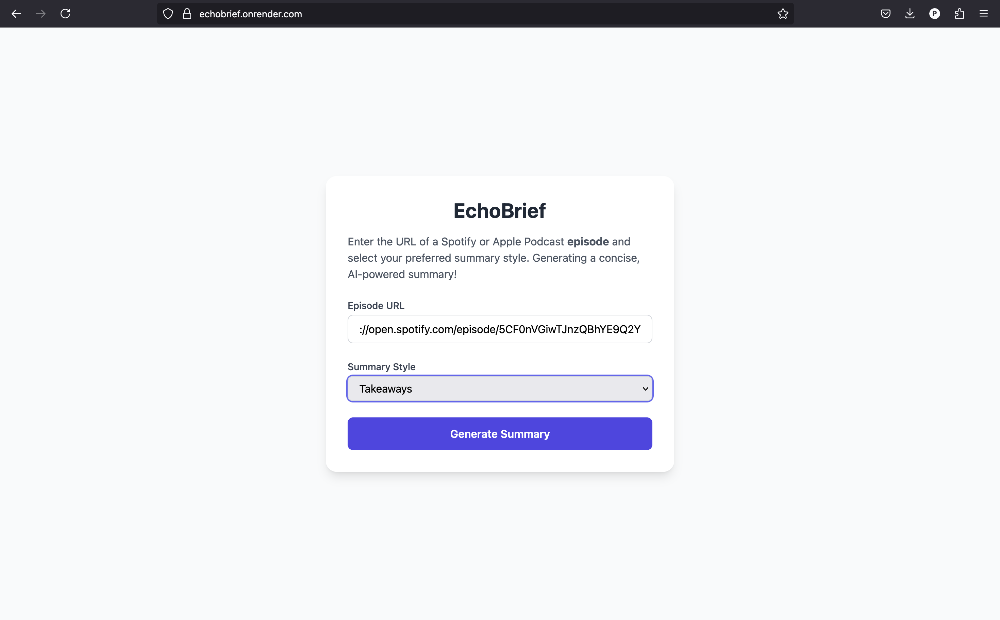
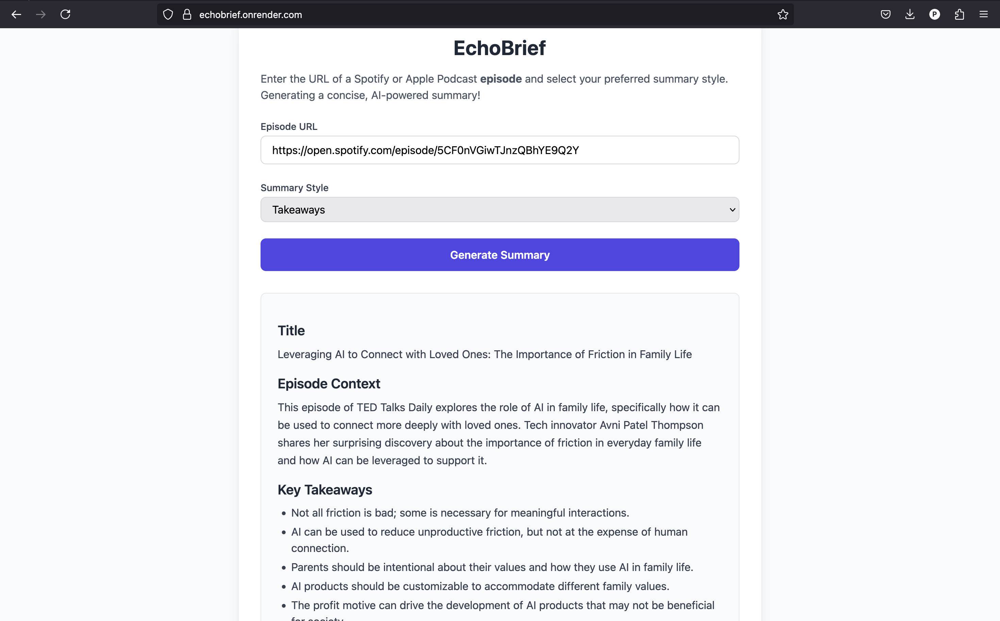

[](https://github.com/apatni24/EchoBrief/actions/workflows/ci.yml)

# 🎧 EchoBrief — Scalable Podcast Summarization Backend

**EchoBrief** is an event-driven backend system that transcribes and summarizes podcast episodes in real time. Users simply paste a podcast episode URL, choose a summary format (bullet points, narrative, or takeaways), and receive a high-quality summary within a minute for episodes up to 30 minutes.

> 🔗 **Live App**: [https://echobrief.onrender.com](https://echobrief.onrender.com)  
> ⏱️ **Summarizes a 30-minute podcast in <90 seconds**  
> 🌍 Deployed on low-latency infrastructure (Singapore – Render + Upstash)

---

## 🧠 Why This Project Stands Out

EchoBrief was built to solve real-world backend engineering challenges. It showcases:

- 🔄 Loose coupling across services using Redis Streams
- 📡 Real-time updates with WebSockets for instant feedback
- 🧠 Scalable summarization via LLaMA 3.3 70B LLMs
- 🐳 Unified Dockerized deployment with internal NGINX routing
- 🚦 Thoughtful design to handle cold starts and API rate limits

---

### 🐳 Why Only One Dockerfile in a Microservices Setup?

Although EchoBrief follows a microservices architecture, all services are hosted on a single server and exposed on different ports. An NGINX reverse proxy is used to route traffic appropriately.

This design choice avoids multiple Dockerfiles and leverages Render’s free-tier constraints efficiently.

---

## 🧩 Architecture



---

## 🔁 Cold Start Optimization

Render auto-suspends inactive services, which can cause a ~25–30s delay on the first request. To combat this:

> ⚡ As soon as the frontend loads, it pings the backend's `/health` endpoint to **pre-warm** the server — ensuring fast, seamless user experience even after idle periods.

---

## 📨 Example Payload

Here’s a sample event payload passed to the Redis Stream (`audio_uploaded`) when a podcast is fetched:

```json
{
  "file_path": "",
  "metadata": {
    "summary": "",
    "show_title": "",
    "show_summary": ""
  },
  "summary_type": "",
  "job_id": ""
}
```
**Fields explained:**

- `file_path`: Local/remote audio path  
- `metadata`: Podcast title, episode summary, and show description  
- `summary_type`: Format (e.g., `ts` = story-style/takeaways)  
- `job_id`: Correlation ID for async WebSocket updates  

---

## 🛠️ Tech Stack

| Layer              | Tool / Service                           |
|--------------------|------------------------------------------|
| Audio Resolution   | Python + feedparser                      |
| Transcription      | AssemblyAI (diarization + speech-to-text)|
| Summarization      | LLaMA 3.3 70B Versatile (via API)        |
| Events             | Redis Streams (Upstash – Singapore)      |
| Real-Time Updates  | WebSockets                               |
| Infrastructure     | Docker + NGINX + Render                  |
| Frontend           | Simple React App                         |

---

## 📁 Project Structure

```plaintext
echobrief/
├── podcast_audio_resolver_service/    # RSS parsing, file download & event emit
├── transcription_service/             # Diarization + transcription via AssemblyAI
├── summarization_service/             # LLM-based summarization
├── redis_stream_client.py             # Redis Streams abstraction
├── nginx.conf                         # Reverse proxy config (internal routing)
├── Dockerfile                         # Container for all services
├── start.sh                           # Entrypoint to run everything
└── audio_files/                       # (Optional) Local audio storage
```

---

## 📄 Summary Types Supported

EchoBrief supports the following summary formats:

- Bullet point breakdowns
- Story-style narrative summaries
- Key actionable takeaways

---

## 📉 API Rate Limiting

To comply with **ChatGroq API's per-minute token limit**, EchoBrief enforces:

> ⏳ **A 60-second cooldown between successive LLM summarization requests**

This ensures:

- No unexpected rate-limit errors during high load
- More predictable performance under concurrent usage
- Graceful queuing of summaries without affecting user experience

> The rate-limiting is implemented with an internal wait logic before calling the LLM API, keeping throughput compliant with usage constraints.

---


## 🚀 Getting Started (Local Dev)

```bash
# Clone the repo
git clone https://github.com/apatni24/EchoBrief.git
cd EchoBrief

# Build and run
docker build -t echobrief .
./start.sh
```

You’ll have:

- All backend microservices up on internal ports
- NGINX reverse proxy managing internal routes
- Redis Streams wiring event flow between services

---

## 🖼️ Frontend Screenshots

  
*User inputs podcast URL and selects summary type.*

  
*Generated summary is displayed live via WebSocket.*

---

## 👨‍💻 Author

Built by [Atishay Patni](https://www.linkedin.com/in/atishaypatni)  
SDE @ Wells Fargo | Backend Engineer 

---

## 📌 Future Enhancements

- GPU-based transcription (WhisperX + PyAnnote)
- Support for >30 min podcasts (chunking + parallel summary stitching)
- Authentication and saved summary history
- Podcast directory browsing from within the app

---
